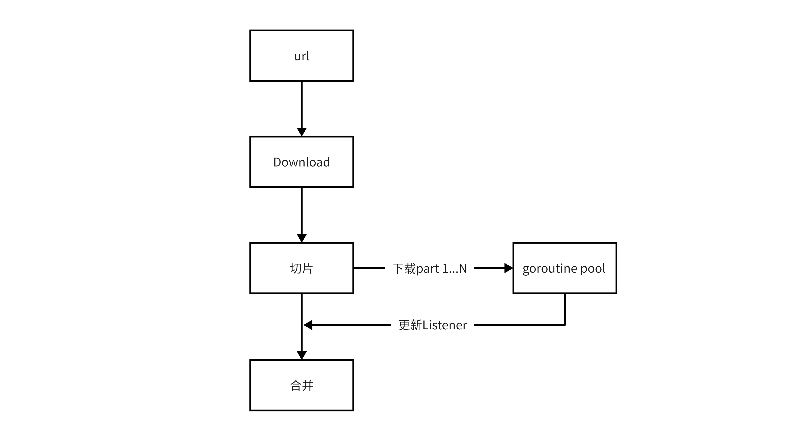

# 并发分片文件下载

## 原理

我在做类似于百度云一样的软件，需要一个下载远程文件的功能，可以让用户指定N个并发，并对远程的大文件进行切片进行下载。支持断点续传和进度统计。



一个文件会被切割成N个Part，所有的Part会被放在M个协程中排队执行，全部切片下载完成以后进行合并。

每个part的大小被称为 partSize，例如5MB

## 代码使用方法

```go
func main() {
	url := "https://xxx/xxx.mp4"
    // 这里会启动一个携程池
    langgo.Run(&Instance{})
    //这里会切分文件，下载分片合并
    Get().Download(context.Background(), url, "./example.mp4", &Listener{})
}
```


## 文件分割

第一次读取远程文件获取文件大小

```go
resp, err := http.Get(url)
if err != nil {
    return nil, err
}
defer resp.Body.Close()
fileSize := resp.ContentLength
if fileSize == -1 {
    return nil, errors.New("file size is error")
}

count := int(math.Ceil(float64(fileSize) / float64(d.partSize)))
```

中间文件

```
example.mp4.db
example.mp4.dp0
example.mp4.dp1
...
```
db文件 - 如果下载没有彻底完成，当重新使用Download方法会先从本地加载db文件，并读取parts的下载状态，只去下载没有完成的分片，达到断点续传的目的。

dp文件 - 从0-N表示分片的序号，每个分片的大小是指定的partSize

临时文件在下载完成合并后被清理。

## 协程池

创建

```go
pool, _ = ants.NewPoolWithFunc(instance.Workers, func(i interface{}) {
    params := i.(*invokeParams)
    downloadPartToFile(params)
})
```

投递

```go
for _, part := range parts {
    if !part.isCompleted {
        pool.Invoke(&invokeParams{
            ctx:       ctx,
            completed: completed,
            failed:    failed,
            url:       url,
            buf:       make([]byte, d.bufSize),
            dst:       dpPath(part.id, dst),
            part:      part,
            fileSize:  fileSize,
        })
    }
}
```

## 合并文件

```go
func merge(dst string, parts []*part) error {
	dstDir := filepath.Dir(dst)
	dstBase := filepath.Base(dst)
	newFilename, err := helper_os.NewFilename(dst, 10, nil)
	if err != nil {
		return err
	}

	fs, err := os.Create(newFilename)
	defer fs.Close()
	if err != nil {
		return err
	}
	var offset int64 = 0
	for i := 0; i < len(parts); i++ {
		pf := filepath.Join(dstDir, fmt.Sprintf("%s%s%d", dstBase, suffixDp, i))
		buf, err := os.ReadFile(pf)
		if err != nil {
			return err
		}
		at, err := fs.WriteAt(buf, offset)
		if err != nil {
			return err
		}
		offset += int64(at)
	}

	os.Remove(dbPath(dst))
	for i := 0; i < len(parts); i++ {
		os.Remove(dpPath(i, dst))
	}

	return nil
}
```

## 监听进度

```go
type Listener struct {
}

func (l Listener) ProgressChanged(event *helper_progress.ProgressEvent) {
    // 打印进度
	fmt.Println(event)
}

url := "https://xxx/xxx.mp4"
langgo.Run(&Instance{})
Get().Download(context.Background(), url, "./example.mp4", &Listener{})
```

listener 会反馈两个重要的变量

ConsumedBytes - 已经传输的文件大小

TotalBytes - 总的大小（也就是文件大小）

## 代码地址

并发分片下载是 langgo 框架的一个 组件

[download组件文档](https://langwan.github.io/langgo/book/components/download/)

[langgo框架](https://github.com/langwan/langgo)