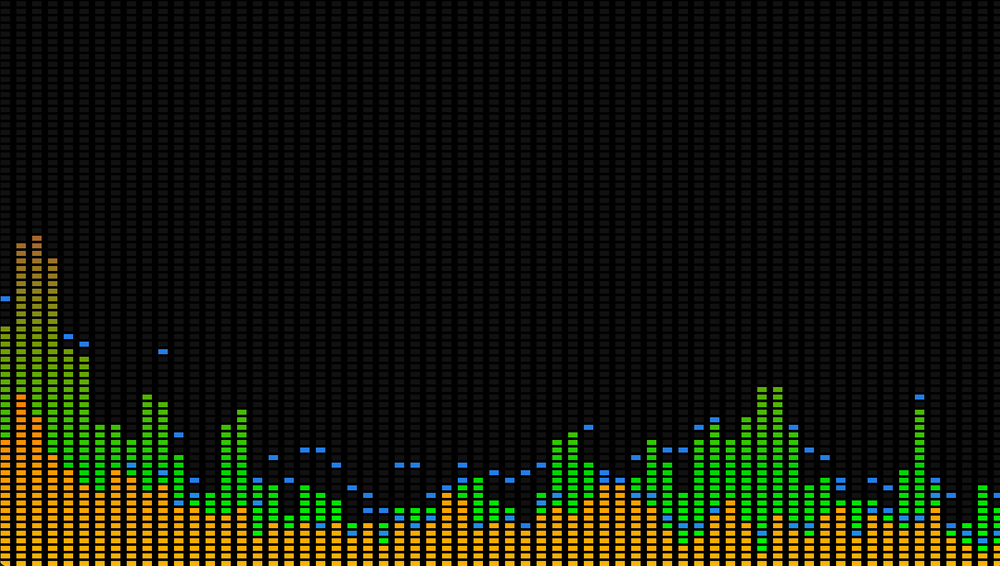
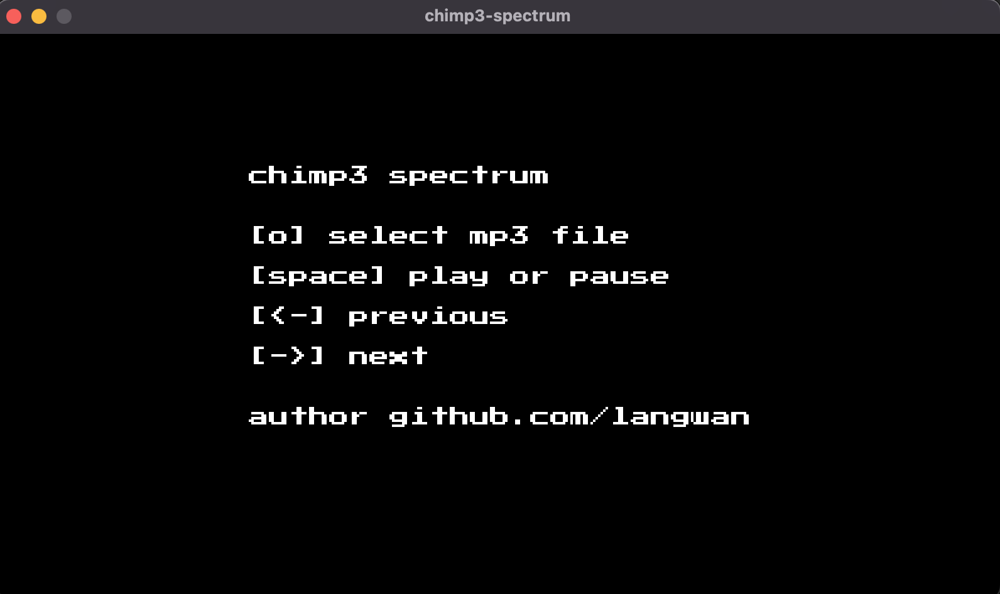
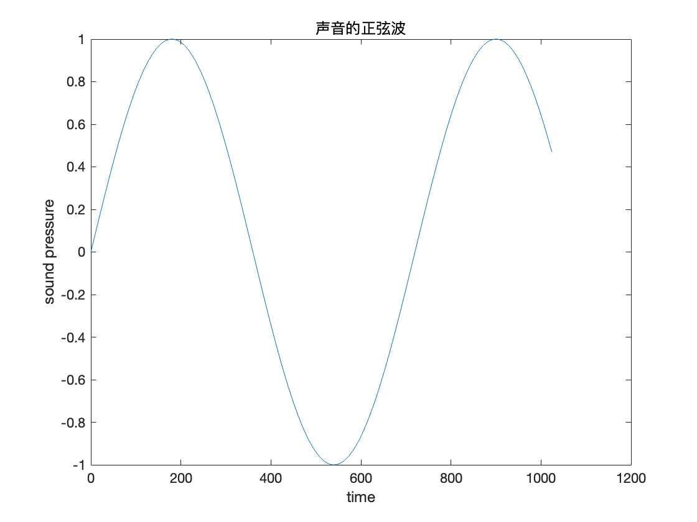
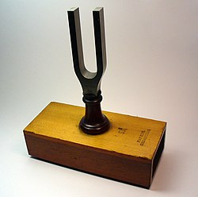
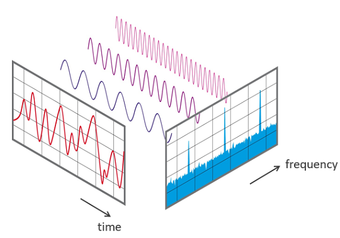

# 音频分析图谱实现

我们以MP3为例，其它格式相同，只要能还原成PCM数据就可以套用后面的分析结果绘制图谱。




## 原理

### 声音和声卡

声音就是空气中的震动，纯净的声音在数学上就是正弦曲线，在信号学里就是正弦波。当我们站在大街的人群当中，不同频率的正弦波混合到一起传入耳朵，就是我们听到的世界。



x轴是时间 y轴是声压 任何可以被振动的膜理论上都可以采集声音，例如麦克风的碳膜，碳膜连接着电极，把声压转换成电压。所以在PCM的数据中可以存在负数，也可以用-1到1之间的浮点数来表示声压。PCM数据传输到声卡里就转换成电压，我们就可以通过声卡播放音乐。

所以声音的发生端是震动



采集端和播放端都是膜

膜 --采集--> PCM -- 信号 --> 放大（音量） --> 声卡 --> 音箱(膜)

### PCM

PCM是可以直接传入声卡的音频数据流，对于8bit（1个字节）的数据流声压级别为256（2个字节），对于16bit的数据流声压的级别是65536，声压级别越大，对声音的还原度越精准。

声道数 channels 一般是2声道
bit深度 bit depth 一般是8bit 16bit 32bit
双声道16bit采集数据大小 16 / 8 * 2 = 4字节

### 正负的意义

数据可以是-200、200，转化成电压可能是-5V、5V，对于-200、200的绝对值都是200，-5V、5V的电压都是5V。正负是相对于参考点的而言的。所有带震动的东西，有正负都是很正常的，而振幅代表能量。

所以不同的声卡驱动可以支持多种数据类型，我们以16bit的PCM为例，可以是

singal  -1到+1

int16  -32768到+32767

uint16 0到65536 （播放器应该对数据进行正负数的重新修正）

所以我们使用不同的播放器有一些截取的数据是浮点型、有一些是整型，只要解码和播放两端对数据的解释一致就可以。


## MP3 播放流程

解码器 -- pcm数据流 --> 播放器 -- pcm数据流 --> 声卡 --> 音箱

## 分析流程

```
解码 -- 浮点样本 --> 窗 --> 时域转频域FFT --> 倍频程 --> 计权（过滤） --> 平滑 --> 动画效果 --> 输出
```

### 解码

解码出来的是PCM编码，这个编码是声卡直接识别的流，可以直接写入声卡播放音频。人耳可以识别的频率范围20-20000Hz，所以一般采样率是44100Hz。参考 奈奎斯特定律 44100Hz的奈奎斯特定律是 N/2 = 22050Hz。

还一种说法是人耳膜对震动的平均响应时间是22.6微秒，约等于 1/44100

双音道 16bit 每个采样的大小是 2 * (16 / 8) = 4 Byte，每次读取1152个样本约等于26ms


### 时域和频域




时域是我们最容易理解的方式，一首歌从0秒播放到结束，X轴以时间向前推进就是时域，频域就是以频率为X轴，可以看到不同频率下声音的强弱变化，这就使我们实际看到的频谱。频谱为X轴，声音（分贝）为Y轴的柱状图。


### FFT (快速傅里叶变换 fast Fourier transform)

FFT可以帮我们完成从时域向频域的转换，所以任何和信号、音频有关的软件和硬件里都有标准的FFT实现。我们知道这一点就可以，具体内容可以参考资料中的文章。

我们只需要知道 FFT 的输入是 float 输出是 complex128 (复数)，经过FFT转换以后X轴变为频率从0至(44100/2)Hz Y轴是分贝(dB)

### 振幅分贝公式

```go
dB := 20 * math.Log10(linear)
```

### 加窗

在进行FFT变换之前，大部分频谱软件都会对原始时域数据进行加窗，加窗是为了减少泄漏，这个话题可以参考更多的资料，在本文中只要知道，这是一个不可以忽略的流程。FFT之前加窗，常见的窗有blackman、hanning、haming等，不同的频谱软件喜欢使用不同的窗函数，窗函数是一种计权函数。


## 计权

原始采样的数据与人耳听到的声音有差异，使用计权就行修正，修正后的声音分布更接近人耳，我们买的分贝仪，默认的是A-weighting

 * A-weighting - 模拟了人可以听到的声音
 * C-weighting
 * Z-weighting

chimp3-spectrum 没有做任何计权，我们做的是音乐娱乐频谱，不是严谨的分贝探测器。

### 倍频程

如果是专业的信号处理分析软件，一定要知道倍频程，并且按照倍频程的方式来严谨的统计频域的数据，但在实际编码过程中，经过反复实验，使用倍频程的图谱面积较大，看上去不过瘾。所以我的代码中没有使用倍频程来制图。

### 奈奎斯特频率

如果单次采集的样本是2048个，那么时域转频域的结果数组是1024个，也就是N/2，因为经过FFT变换以后有一半数据是相同的，所以只能使用一半，这就是奈奎斯特频率。

## 用Web Radio Api实现图谱

AudioContext 结合 createAnalyser ，直接返回一个包装好的fft结果，本文的实现核心内容是直接阅读AudioContext的源代码，从c++代码翻译成go语言实现的，部分内容是通过其它文章和代码实现的。

## mathlab

在我制作频谱的过程中，为了学习安装了mathlab软件，里面有大量的文章介绍音频处理、信号处理，并且是一个非常好的可以快速验证结果的工具。

## 代码实现

使用日本程序员Hajime Hoshi写的 go-mp3 oto ebiten 三件套实现的，开始用的go-mp3 oto，后来发现ebiten也是这个人写的，干脆就用这一套下来写成一个mp3播放器

## 源代码下载

[chimp3-spectrum] https://github.com/langwan/chimp3-spectrum

参考

[PCM] https://en.wikipedia.org/wiki/Pulse-code_modulation
[奈奎斯特频率] https://zh.m.wikipedia.org/zh-hans/%E5%A5%88%E5%A5%8E%E6%96%AF%E7%89%B9%E9%A2%91%E7%8E%87
[audiomotion.dev] https://audiomotion.dev/demo/fluid.html
[h5实现的最简单的频谱] https://github.com/wayou/HTML5_Audio_Visualizer
[响度] https://zh.wikipedia.org/zh-hans/%E9%9F%BF%E5%BA%A6

[一步一步教你实现iOS音频频谱动画（一）] https://juejin.cn/post/6844903784011792391
[一步一步教你实现iOS音频频谱动画（二）]https://juejin.cn/post/6844903791670591495

[mathworks]
https://ww2.mathworks.cn/help/audio/ug/audio-weighting-filters.html?searchHighlight=a-weighting%20&s_tid=srchtitle_a-weighting%20_2
https://ww2.mathworks.cn/help/audio/ref/octavefilter-system-object.html
https://ww2.mathworks.cn/help/dsp/ref/spectrumanalyzer.html?searchHighlight=spectrumAnalyzer&s_tid=srchtitle_spectrumAnalyzer_1
https://ww2.mathworks.cn/help/audio/ug/octave-band-and-fractional-octave-band-filters.html
https://ww2.mathworks.cn/help/audio/ug/sound-pressure-measurement-of-octave-frequency-bands.html

[倍频程] https://zhuanlan.zhihu.com/p/26732433?refer=Auto-NVH
[三分之一倍频程] https://zhuanlan.zhihu.com/p/396189927?ivk_sa=1024320u

[分贝] https://zhuanlan.zhihu.com/p/22821588?refer=Auto-NVH
[倍频程] https://cn.comsol.com/blogs/new-octave-band-plot-for-acoustics-simulations-in-version-5-2/


[How to create 1/3-Octave-Band Filters in MatLAB/Octave] https://stackoverflow.com/questions/35324394/how-to-create-1-3-octave-band-filters-in-matlab-octave
[Computes a forward or inverse in-place, single-precision real FFT.] https://developer.apple.com/documentation/accelerate/1450150-vdsp_fft_zrip